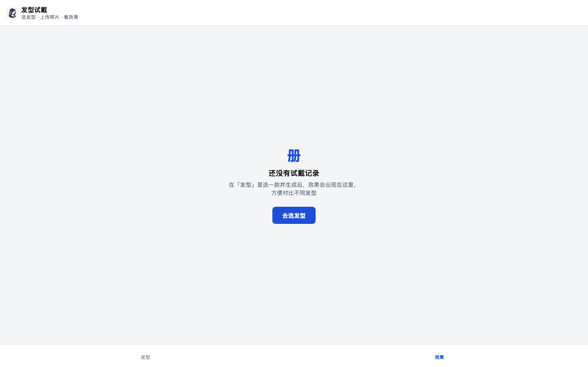
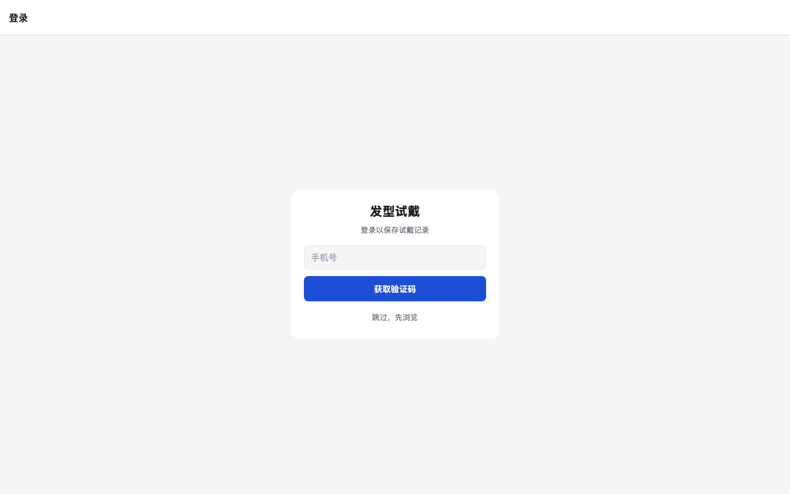
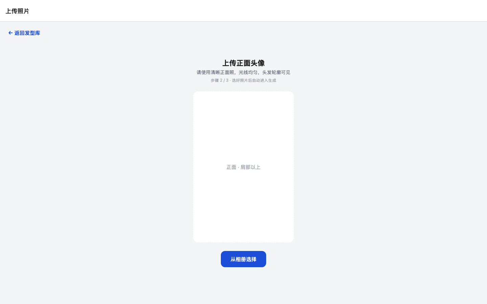
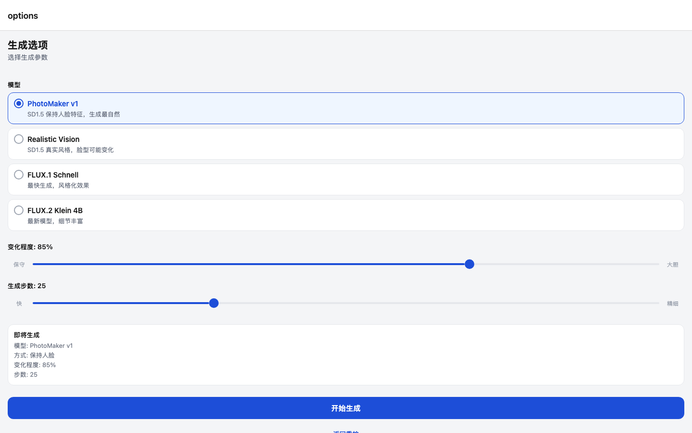
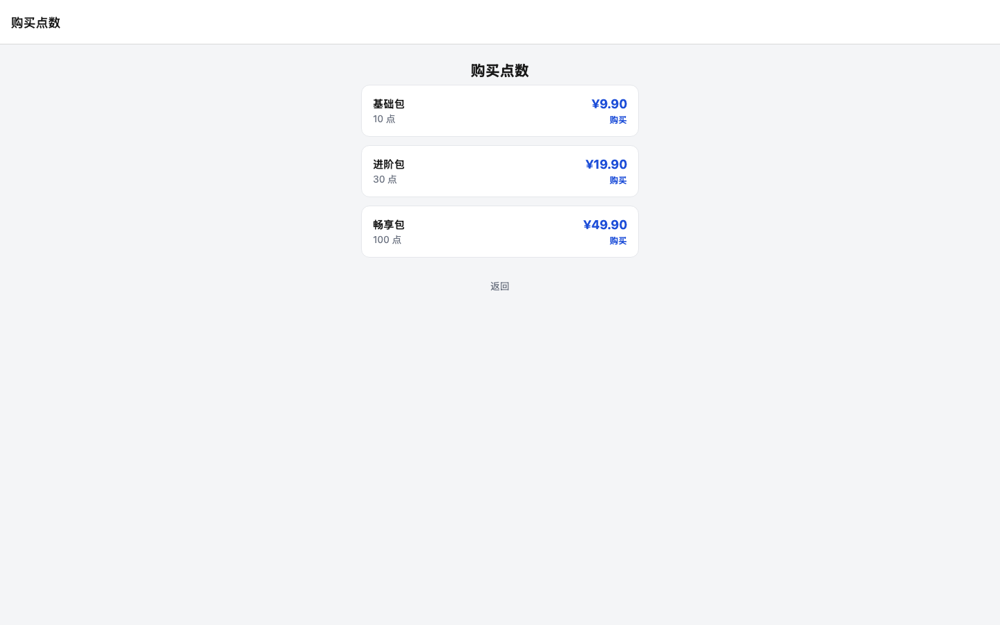
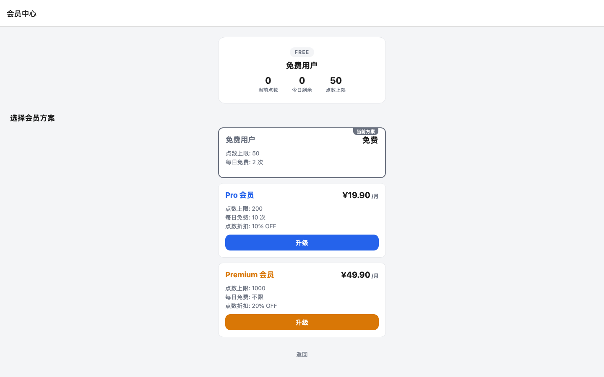

# 发型试戴 — AI 虚拟发型试戴

面向国内理发行业的 AI 虚拟发型试戴 App。用户上传人像照片，选择发型模板，本地 ComfyUI 生成发型效果图，辅助理发决策。

> 个人开发者业余项目 · MVP 阶段  
> **App 名称：** 发型试戴  
> **当前 AI 后端：本地 ComfyUI 多管线**（PhotoMaker v1 / SD1.5 / FLUX.2 Klein 4B）  
> **开发环境：** macOS (CPU-only) — FLUX.1 Schnell 12GB GGUF 无法加载，FLUX.2 Klein txt2img 8GB CLIP OOM，因此前端只展示 CPU 可行组合

---

## 功能

| 功能 | 状态 |
|------|------|
| 发型模板浏览（响应式网格 + 男女分类 + catalog 缩略图） | ✅ |
| 拍照 / 相册上传头像 | ✅ |
| AI 生成发型效果图（本地 ComfyUI，3 条管线可选） | ✅ |
| 生成选项页：模型 / 文生图·图生图 / 变化程度 / 步数 | ✅ |
| FLUX.2 Klein 原生编辑工作流（ReferenceLatent，保留自拍人脸特征） | ✅ |
| 效果图预览（保存 / 分享 / 重试） | ✅ |
| 换发型并保留照片继续试戴 | ✅ |
| 「效果」页：本机试戴历史 + 每张图的生成参数（模型/方式/步数等） | ✅ |
| 多角度生成（正 / 左 / 右 / 后 4 角度） | ✅ |
| 发型参数调整（长度 / 卷曲 / 颜色 → prompt 重新生成） | ✅ |
| 原图对比（Before/After 滑块） | ✅ |
| 用户登录（手机号 + 开发万能验证码 `888888`；微信/支付宝为 stub） | ✅ |
| 点数系统（余额 / 扣点 / 流水；开发期 `SKIP_POINTS_CHECK=true` 豁免） | ✅ |
| 充值（套餐 + mock 支付回调） | ✅ |
| 会员等级（tiers / 升级 / 我的状态） | ✅ |
| 脸型适配推荐（`POST /api/recommend/by-photo`） | ✅ |
| 品牌 Logo / Favicon（Web + App） | ✅ |
| 真实短信 / 真实支付接入 | ⏳ P1 |
| 云端生成历史 | ⏳ P2 |

---

## 架构

```
mobile/  (React Native Expo · 发型试戴)
    │  HTTP（axios，JWT Bearer）
    ▼
backend/  (Python FastAPI + SQLite via SQLAlchemy async)
    ├── GET  /api/templates              → templates_comfyui.json + /static/thumbnails
    ├── POST /api/comfyui/generate       → Face (MediaPipe) + ComfyUI 多管线
    ├── POST /api/comfyui/regenerate     → 参数调整（prompt_builder）重新生成
    ├── POST /api/comfyui/generate-multi → 4 角度生成（串行，Semaphore(1)）
    ├── POST /api/v1/auth/*              → 短信登录（万能码）+ JWT
    ├── POST /api/v1/payment/*           → 套餐 / 下单 / mock 支付回调
    ├── POST /api/v1/membership/*        → 会员等级 / 升级 / 状态
    └── POST /api/recommend/by-photo     → 脸型检测 + 模板推荐
              │
              ▼
         ComfyUI :8188  (Pinokio / 本机)
              │
              ▼
         backend/output/  +  backend/static/thumbnails/  +  backend/hairstyle.db
```

### 生成管线（`pipeline` 字段）

| pipeline | 模型文件 | 特点 | CPU 可行性 |
|----------|----------|------|-----------|
| `photomaker` | `photon_v1.safetensors` + `photomaker-v1.bin` | SD1.5 + 人脸嵌入，保脸最自然（默认） | ✅ 35-52s |
| `sd15` | `realisticVisionV60B1_v60B1VAE.safetensors` | SD1.5 真实风格 txt2img / img2img | ✅ 23-48s |
| `flux_klein` | `flux-2-klein-4b-Q8_0.gguf` + `qwen_3_4b.safetensors` + `flux2-vae.safetensors` | FLUX.2 Klein 4B（GGUF，需 ComfyUI-GGUF 节点） | ✅ img2img 157-163s；❌ txt2img OOM（8GB CLIP） |
| ~~`flux`~~ | ~~`flux1-schnell-Q8_0.gguf` + `clip_l` + `t5xxl_fp16` + `ae.safetensors`~~ | ~~FLUX.1 Schnell~~ | ❌ 已移除（12GB 模型，CPU 无法运行） |

- `method`：`photomaker`（保脸）/ `txt2img` / `img2img` — `flux_klein` 在前端仅展示 img2img
- **flux_klein + img2img 走原生编辑工作流**（官方 "Image Edit (Flux.2 Klein 4B Distilled)" 模板）：
  `CLIPLoader(type="flux2")` 单编码器 + 自拍经 `VAEEncode` 注入 `ReferenceLatent`（正/负条件均注入）
  + `CFGGuider(cfg=1.0)` + `euler` + `Flux2Scheduler` + `SamplerCustomAdvanced`。
  相比通用 img2img（高 denoise 重采样），**显著更好地保留自拍者脸部特征**，只按指令换发型。
  提示词自动包装为编辑指令（"保持脸部/表情/肤色/背景/光线不变，只换发型"）。
- 模板 JSON 里的 SD1.5 `checkpoint` 不会泄漏进 flux 管线（非 `.gguf` 覆盖值会被忽略并回退默认）。
- ComfyUI 400 校验错误会被完整记录并透传到 502 响应（`node_errors` 详情），便于定位缺失模型。
- **SD1.5 img2img 修复**：`_build_sd15_img2img_workflow` 插入了 `ImageScale(bilinear)` 节点，将用户照片缩放到模板尺寸后再 VAEEncode → KSampler，避免加载全分辨率照片（1536×2730）导致 10× 耗时；生成时间从 >600s 降至 23-48s。

### 生成结果在哪里？

| 位置 | 说明 |
|------|------|
| App **「效果」** Tab | 本机 AsyncStorage 试戴历史（含每张图的生成参数 metadata） |
| `backend/output/{uuid}.png` | 服务端落盘的生成图 |
| `http://localhost:8000/api/comfyui/output/{filename}` | 上述文件的 HTTP 访问地址 |
| `backend/static/thumbnails/{id}.png` | 发型库 catalog 预览图（非用户试戴结果） |

### 前端

- **React Native (Expo SDK 57)** + Expo Router
- 响应式布局：手机 2 列 / 平板 3 列 / 桌面 Web 4 列；缩略图保持 **2:3**
- @tanstack/react-query；`generation.ts` → **`POST /api/comfyui/generate`**
- Session：保留上次照片，换发型可跳过重新上传
- 登录：JWT 存 AsyncStorage，axios 拦截器自动带 `Authorization: Bearer`
- 品牌资源：`mobile/assets/`（icon / favicon / logo）+ `mobile/public/`（Web 静态）
- **生成超时**：默认 axios 60s → `generation.ts` 覆盖为 **300s** 以适配 flux_klein（163s）
- **失败导航**：预览页生成失败时显示"返回生成选项"按钮，回到 options 页保留参数，而非仅返回首页

**页面流：** 发型库 → 上传照片 → 生成选项（模型/方式/参数）→ AI 生成预览（参数调整 / 多角度 / 原图对比）→ 效果历史（含参数 metadata）

**Web：** `npx expo start --web`；保存降级为下载，分享用 Web Share API 或复制链接。

### 后端

- **Python FastAPI** + uvicorn + **SQLAlchemy async（SQLite `hairstyle.db`）**
- **ComfyUI** HTTP API（多管线，见上表）
- MediaPipe 本地人脸检测；脸型分析（`face_shape.py`）用于推荐
- 模板：`backend/data/templates_comfyui.json`
- 用户 / 订单 / 点数流水：`app/models/{user,order,points_ledger}.py`

---

## 项目结构

```
hairstyle/
├── mobile/                      # Expo 前端（发型试戴）
│   ├── app/
│   │   ├── (tabs)/
│   │   │   ├── index.tsx        # 发型库
│   │   │   └── history.tsx      # 我的效果（历史 + 点数余额入口）
│   │   ├── (auth)/
│   │   │   └── login.tsx        # 手机号 + 验证码登录
│   │   ├── capture.tsx          # 上传照片
│   │   ├── options.tsx          # 生成选项（模型/方式/变化程度/步数）
│   │   ├── preview.tsx          # 生成预览（参数调整/多角度/原图对比）
│   │   ├── result-view.tsx      # 历史详情 + 生成参数 metadata 卡片
│   │   ├── recharge.tsx         # 点数充值（mock 支付）
│   │   ├── membership.tsx       # 会员中心（等级查看/升级）
│   │   ├── +html.tsx            # Web title / favicon
│   │   └── _layout.tsx
│   ├── assets/                  # icon、favicon、logo、splash
│   ├── public/                  # Web 静态 favicon.ico 等
│   ├── components/              # ParamPanel / AngleSelector / BeforeAfterSlider / ResultView / ActionButtons / FocusedScreen
│   ├── constants/theme.ts       # 设计 token
│   ├── context/SessionContext.tsx
│   ├── hooks/useLayout.ts       # 响应式列数
│   └── services/
│       ├── api.ts               # axios 实例 + JWT 拦截器 + 按平台探测主机
│       ├── generation.ts        # → /api/comfyui/(generate|regenerate|generate-multi)
│       ├── history.ts           # 本机试戴历史（含生成参数）
│       ├── auth.ts              # 登录 / token / 用户信息
│       ├── payment.ts           # 套餐 / 下单 / mock 回调
│       ├── membership.ts        # 会员等级 / 升级
│       └── templates.ts         # 模板列表
├── backend/
│   ├── app/
│   │   ├── routers/             # templates / comfyui_generation / auth / payment / membership / face_recommend
│   │   ├── services/            # comfyui / face / face_shape / prompt_builder / auth_service / points_service / membership_service
│   │   ├── models/              # schemas.py + user.py / order.py / points_ledger.py (SQLAlchemy)
│   │   ├── database.py          # async engine + session（SQLite）
│   │   ├── dependencies.py      # get_current_user（JWT）
│   │   └── config.py            # pydantic-settings（.env）
│   ├── data/templates_comfyui.json
│   ├── static/workflows/        # ComfyUI 可拖入 JSON（供手动调试）
│   ├── tests/                   # 后端测试（pytest）
│   ├── scripts/                 # generate_thumbnails.py / test_comfyui.py / convert_api_to_workflow.py
│   ├── static/thumbnails/       # catalog 预览
│   ├── output/                  # 生成结果
│   └── hairstyle.db             # SQLite（用户/订单/点数流水）
├── Makefile                   # 开发命令（make init/start/stop/test/…）
├── docs/
├── README.md
└── AGENTS.md
```

---

## 快速开始

本项目提供 `Makefile` 快速命令（推荐），也支持手动启动。

```bash
make init       # 安装后端 + 前端依赖
make start      # 启动后端 + 前端
make stop       # 停止所有服务
make check      # 健康检查（ComfyUI / 后端 / 前端）
make test       # 运行后端测试
make logs       # 查看后端日志
make thumbnails # 重新生成 catalog 缩略图
make db-reset   # 删除并重建 SQLite 数据库
```

详见 [`Makefile`](Makefile) 所有命令。

### 前置条件

- Node.js 20+ / npm
- Python 3.12+
- Expo Go 或模拟器 / 浏览器
- **本机 ComfyUI**（推荐 Pinokio），`http://127.0.0.1:8188`
  - PhotoMaker 路径：`photon_v1.safetensors` + `photomaker-v1.bin`（**不要用 v2**）
  - FLUX.2 Klein 路径（可选）：`flux-2-klein-4b-Q8_0.gguf` + `qwen_3_4b.safetensors` + `flux2-vae.safetensors`，需 ComfyUI-GGUF 自定义节点
- 详见 [`docs/ds_comfyui_setup.md`](docs/ds_comfyui_setup.md)、[`backend/static/workflows/README.md`](backend/static/workflows/README.md)

### 1. ComfyUI

```bash
curl -s http://127.0.0.1:8188/system_stats | head -c 200
```

### 2. 后端

```bash
cd backend
pip install -r requirements.txt
cp .env.example .env
uvicorn app.main:app --reload --host 0.0.0.0 --port 8000
```

```bash
curl http://localhost:8000/
curl http://localhost:8000/api/templates
```

### 3. 前端

```bash
cd mobile
npm install
npx expo start          # 扫码 / 模拟器
npx expo start --web    # 浏览器（可见品牌 favicon）
```

> API 主机由 `mobile/services/api.ts` 按平台自动探测。国内网络可试 `--tunnel`。

### 可选：重建 catalog 缩略图

```bash
cd backend
python scripts/generate_thumbnails.py
python scripts/generate_thumbnails.py --id m1 --force --seed 42
```

### 运行测试

```bash
cd backend
PYTHONPATH=. python -m pytest tests/ -v
```

或通过 Makefile：
```bash
make test
```

---


## 环境变量

| 变量 | 说明 |
|------|------|
| `COMFYUI_URL` | ComfyUI 地址，默认 `http://127.0.0.1:8188` |
| `DATABASE_URL` | SQLite 路径，默认 `sqlite+aiosqlite:///./hairstyle.db` |
| `JWT_SECRET_KEY` / `JWT_ALGORITHM` / `JWT_EXPIRE_HOURS` | JWT 签名配置（仅开发） |
| `SKIP_POINTS_CHECK` | 开发期跳过点数校验，默认 `true` |
| `DEV_MAGIC_CODE` | 万能验证码，默认 `888888` |

---

## API

| 方法 | 路径 | 说明 |
|------|------|------|
| `GET` | `/` | Health |
| `GET` | `/api/templates` | 模板列表（可选 `?category=men\|women`）；缩略图绝对 URL |
| `GET` | `/api/templates/{id}` | 模板详情 |
| `POST` | `/api/comfyui/generate` | **主路径**：`photo_base64` + `style_id` + `pipeline`/`method`/`steps`/`cfg`/`denoise` |
| `POST` | `/api/comfyui/regenerate` | 参数调整（length/curl/color → prompt）重新生成 |
| `POST` | `/api/comfyui/generate-multi` | 4 角度生成（正/左/右/后） |
| `GET` | `/api/comfyui/output/{filename}` | 生成结果图 |
| `POST` | `/api/v1/auth/sms/send` | 发送验证码（开发期返回万能码） |
| `POST` | `/api/v1/auth/sms/login` | 验证码登录 → JWT |
| `POST` | `/api/v1/auth/wechat/login` · `/alipay/login` | 第三方登录（stub） |
| `GET` | `/api/v1/auth/me` | 当前用户信息（需 JWT） |
| `GET` | `/api/v1/payment/packages` | 点数套餐列表 |
| `POST` | `/api/v1/payment/order` | 创建充值订单（需 JWT） |
| `POST` | `/api/v1/payment/mock/notify` | mock 支付成功回调（开发用） |
| `GET` | `/api/v1/membership/tiers` | 会员等级列表 |
| `POST` | `/api/v1/membership/upgrade` | 升级会员（需 JWT） |
| `GET` | `/api/v1/membership/my-status` | 我的会员状态（需 JWT） |
| `POST` | `/api/recommend/by-photo` | 脸型检测 + 发型推荐 |
| _(已清理)_ | `/api/generate` · `/api/regenerate` | 已移除的遗留 Meitu 路径 |

---

## 部署

- **开发：** 本机 FastAPI + ComfyUI  
- **后端：** `docker build -t hairstyle-api ./backend && docker run -p 8000:8000 hairstyle-api`（需可达的 ComfyUI）  
- **建议：** 阿里云 ECS；GPU 跑 ComfyUI，或本机 Pinokio 调试

---

## 路线图

- **P1（已完成）：** 发型参数滑条、多视角、原图对比、登录、点数、mock 充值、会员等级
- **P1（待办）：** 真实短信通道、真实微信/支付宝支付
- **P2（已完成）：** 脸型适配推荐（`POST /api/recommend/by-photo`）、多级会员（Pro / Premium）
- **P2（待办）：** 云端生成历史、收藏、工作流升级（HairPort / ACE++）

---

## 相关文档

| 文档 | 内容 |
|------|------|
| [`AGENTS.md`](AGENTS.md) | Agent / 开发约定 |
| [`docs/ds_comfyui_setup.md`](docs/ds_comfyui_setup.md) | ComfyUI 模型与调试（含 FLUX.2 Klein） |
| [`docs/oc_flux2_klein_integration.md`](docs/oc_flux2_klein_integration.md) | FLUX 管线集成与原生编辑工作流 |
| [`docs/ds_comfyui_proposal.md`](docs/ds_comfyui_proposal.md) | ComfyUI 方案说明 |
| [`docs/features-implementation.md`](docs/features-implementation.md) | P1 功能实现方案（登录/点数/参数/多角度） |
| [`docs/oc_p2-implementation.md`](docs/oc_p2-implementation.md) | P2 脸型推荐 + 会员实现 |
| [`docs/oc_p2-face-shape-membership.md`](docs/oc_p2-face-shape-membership.md) | P2 设计方案（面部推荐 + 多级会员） |
| [`backend/static/workflows/README.md`](backend/static/workflows/README.md) | Workflow 使用 |
| [`docs/superpowers/specs/2026-07-17-comfyui-catalog-thumbnails-design.md`](docs/superpowers/specs/2026-07-17-comfyui-catalog-thumbnails-design.md) | Catalog 缩略图设计 |

---

## License

MIT

<!-- screenshots -->
| Home | History | Login |
| --- | --- | --- |
|  |  |  |

| Capture | Options | Recharge |
| --- | --- | --- |
|  |  |  |

| Membership |  |  |
| --- | --- | --- |
|  |  |  |

<!-- /screenshots -->
