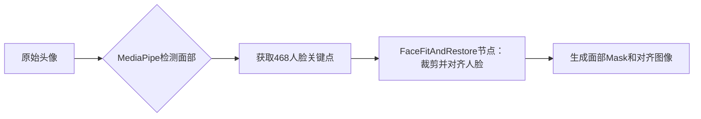

# 执行摘要  
本报告围绕在 MacBook M3 Pro 环境下，通过 Pinokio 平台运行 ComfyUI，自动化生成“发型美化/头像发型组合”任务的解决方案展开。我们系统梳理了发型相关的生成模型、细分模型与工具，并给出针对发色、发型纹理、面部保持、分割、3D 发型建模、视频一致性等不同用途的推荐资源清单，包括 Stable Diffusion checkpoint、VAE、CLIP 版本、LoRA、ACE++、Photomaker、3D/视频模块等；分析了面部检测与对齐的方案（如 MediaPipe、dlib、FaceProcessor 插件），以及如何在 ComfyUI 中集成这些组件并保持原人身份特征；比较了基于掩码替换、图像修补、分割引导生成、参考风格迁移、3D-aware 方法（如 3DMM、NeRF/EG3D）和视频帧一致性策略的不同发型合成思路；提供了典型的模型组合和超参数建议，如 checkpoint+VAE+CLIP+LoRA 的搭配方式、CFG/采样器/步数等；讨论了批处理、延迟、显存和磁盘管理的优化方法；并对自定义发型或人物身份的训练流程（LoRA/DreamBooth/ACE++ 等）、数据准备和超参数进行了总结，给出训练后如何导出并在 ComfyUI 中使用的说明。最后还列出法律伦理和隐私注意事项，及示例 ComfyUI 工作流 JSON/YAML 模板和 REST/Python API 调用示例，并附上调试和常见故障排查清单。总之，本文致力于提供一份详尽的技术指导，帮助构建符合需求的发型和人像编辑工作流。  

## 推荐模型与资源清单  
以下按用途分类列出推荐的模型、LoRA、工具和兼容说明，附带典型文件大小和优先下载源：  

- **发型生成**：可采用高质量人像模型（如 SD-1.5 系列、SD-2.1/2.2、SDXL）+ 艺术风格模型（Realistic Vision V4.0 等）。例如 Stable Diffusion 1.5（约 4GB，CLIP ViT-L/14），SDXL Base 1.0（约 7GB，OpenCLIP ViT-H/14）。**VAE**：对应 SD 版本自带的原生 VAE。**CLIP版本**：SD1.x 用 OpenAI CLIP；SD2.x 用 OpenCLIP（OpenAI CLIP-L/14）；SDXL 用 OpenCLIP ViT-H/14。  
- **发色/发型风格 LoRA**：搜集专门的“发色”或“发型风格” LoRA，例如超写实长发、卷发、丸子头等细节增强 LoRA（各 ~5–200MB，权重可调）。ACE++（全称 All-round Creator & Editor）插件提供指令式人物/发型编辑能力，无需重训练（仅需加载 ACE++ 模型与提示）。**Photomaker** 扩展可为人像生成加入真实感风格（支持 SDXL 基础模型+适配器），提升光影质感。  
- **纹理/细节**：使用 Face Restoration（如 GFPGAN/CodeFormer）增强人脸细节；Hair-specific LoRA（如细发线 LoRA）提升发丝细节。部分预训练模型如 “匿名人物发型集合”（存在于 CivitAI 等）可直接生成特定风格发型。  
- **面部保持**：优选人脸保真模型（如 high-res portrait 模型），并加载对应的 **FaceEmbedder** 或 **InfiniteYou** 等方案为原脸部生成 embedding，用于引导生成保持原身份。不兼容模型（如Anime风模型）可能损伤人像特征。可使用 ComfyUI 插件如 InfiniteYou 进行身份一致性处理。  
- **分割/掩码**：推荐使用高精度分割模型划分人脸与发型区域。**BiSeNet 面部分割**：使用 jonathandinu/face-parsing（SegFormer BiSeNet v2, 模型约339MB）可得到眼睛、嘴巴、面部轮廓、发际线等掩码。**YOLOv8 Head+Hair 分割**：Anzhc 提供的“HeadHair seg”模型（54.9MB 和 6.81MB 两个规模）直接输出头部+头发掩码。**Sam/PersonSeg**：使用 SAM（Segment Anything）或通用人员分割模型，可进一步分离背景。  
- **3D 发型建模**：ComfyUI-3D-Pack 插件（MrForExample）可处理 3D 网格和纹理输入，包含 Instant-NGP（NeRF）、EG3D、GSR（生成三维重建）等节点。使用 EG3D/StyleGAN3D 生成带发型的3D人像，通过渲染获得不同视角、视频帧。部分研究模型（如 3D 头发重建）可作为参考。  
- **视频与帧一致性**：可使用 Stable Video Diffusion（SDV）等扩散视频模型（StabilityAI 发布的 img2vid-xt 等），或将连续帧输入深度/运动引导模块（如 Vid2Vid、TCVE）以增强时序连贯性。ComfyUI VideoHelperSuite 插件提供关键帧插值、Deflicker、时序掩码等节点。针对非实时应用，通过**首帧注入（first-frame injection）**、**光流一致性修补**等手段减少闪烁。  

上述模型均可在 Hugging Face、GitHub 或官方仓库获取。Stable Diffusion 检查点优先使用官方发布或认可社区版本（如 Hugging Face）。VAE 与 CLIP 版本须与所选 SD 模型匹配；ComfyUI 扩展插件可通过 ComfyUI Manager 安装。表格示例如下：  

| 分类       | 模型/资源                    | 用途               | SD 版本兼容     | 依赖节点/插件             | 文件大小   | 下载来源      |
|:----------|:---------------------------|:------------------|:-------------|:-----------------------|:--------|:-----------|
| 发型生成   | Realistic Vision V4.0、SDXL 1.0 等 | 人物发型风格生成      | 1.5/2.x/XL   | ComfyUI 默认Text2Img     | ~4–7GB | 官方 HF 链接  |
| 发色风格   | Hair-LoRA（卷发、直发等）       | 改变发色/发型细节    | 跟随对应 SD | ComfyUI LoRA 加载        | ~10–200MB| CivitAI/HF |
| ACE++   | ACE++（All-round Creator & Editor） | 指令式编辑（脸/发型）   | SD1.5/2.x    | ACE++ 插件               | ~500MB   | GitHub/Flux |
| Photomaker| ComfyUI-PhotoMaker-ZHO       | 写实照片风格增强     | SDXL 系列    | Photomaker ZHO 插件  | ~500MB   | GitHub/ARC  |
| 面部分割   | BiSeNet face-parsing        | 细分面部部位掩码     | N/A          | Segment Face 插件    | ~340MB  | HF (jonathandinu) |
| 头发分割   | Anzhc YOLOv8 HeadHair seg    | 检测头部及头发区域    | N/A          | ComfyUI-YOLO 插件       | 6.8–54.9MB | HF (Anzhc) |
| 3D / Mesh | ComfyUI-3D-Pack            | 3D 模型生成 (mesh/NeRF)| 任何          | ComfyUI-3D-Pack 插件 | 各类组件    | GitHub (MrForExample) |
| 视频处理   | Stable Video Diffusion 等    | 视频帧生成 & 一致性    | SD2.x/XL 等  | VideoHelperSuite 插件   | ~1–2GB   | Stability AI HF |

## 面部识别与对齐流程  
为了提取头像中的人脸并保证后续生成不丢失身份特征，推荐如下方案：  

- **人脸检测/关键点**：使用 MediaPipe Face Mesh（或 comfyanonymous 的 FaceProcessor 插件），可快速检测人脸位置并输出468个精确关键点。插件提供的 **FaceWrapper** 和 **FaceFitAndRestore** 节点可自动对齐面部、归一化眼部位置、并生成面部 mask，适合后续处理。也可选用 dlib/face-alignment 等传统工具获得人脸关键点，在 ComfyUI 中通过 Python 脚本节点调用。  
- **分割检测**：对于头发区域，可先用 YOLO or RetinaFace 检测人脸框，然后使用头+发分割模型（如 Anzhc YOLOv8 HeadHair seg）生成头发掩码。对面部各部位细分，可使用 BiSeNet 面部解析模型（如 jonathandinu/face-parsing）获取眼睛、嘴巴、发际线等掩码。在 ComfyUI 中，可利用“Segment Face”节点（基于 BiSeNet）对**人脸图像**进行细致分割。此外，ComfyUI 也支持使用 SAM 进行自由分割、或 Ultralytics PersonSeg 等节点获取全身分割。  
- **身份保持**：要保持原图身份特征，可将原图通过 VAE 编码注入模型。具体做法包括使用“Image->Latent”节点获取原始图像潜编码，再在生成过程中将其作为条件输入 (Image-to-Image)。此外可加载如 **InfiniteYou**、**Face Detailer** 等工具进行**embed**调节，或在训练时添加人脸ID损失（如 L2 距离）确保一致。生成后，可用 GFPGAN/CodeFormer 等修复节点对脸部进行细节增强。  

综上，工作流中通常先加载原始照片（Image Loader），经 FaceProcessor 检测对齐，再通过分割节点提取面部和发型掩码。这些掩码用于控制生成，如只替换发型区域而保持面部。FaceProcessor 插件示例：  



## 头像与发型组合方法  
针对“用真人照片+发型模板”进行合成，有多种技术路径：  

- **基于掩码替换 (Mask-based Inpainting)**：利用上一步分割得到的头发掩码，在原图上抠出头发区域后执行图像修补。具体步骤：先删除原头发区域 (`将头发掩码置黑`)，再用 SD inpaint 模型（如 SD1.5 Inpaint）以新发型风格的提示词填充该区域。这种方法易于控制发型更替，但需保证掩码边缘过渡自然（可调整 `mask_blur` 值）。  
- **分割引导生成 (Segmentation-guided)**：将头发分割后的区域与人脸区域分离，分别作为两个条件图像输入生成网络。例如使用 ControlNet 的分割模型节点，将人脸和发型分段后分别编辑，再融合结果。这种方式可以更精细地控制各部分生成质量。  
- **参考风格迁移 (Reference-based Style Transfer)**：选取目标发型的参考照片或素描，通过 ComfyUI 中的“语义迁移”节点或 Photomaker 等工具，将参考图的发型风格迁移到原始头像上。如先提取参考发型的风格 embedding，再作为条件指导。  
- **3D-aware 方法**：使用三维形变模型（3DMM）或神经渲染技术生成发型。例如先用 3DMM 配置骨架得到头部三维网格，再对网格加上发型纹理，最后渲染回图像。ComfyUI-3D-Pack 可导入 3D 模型并通过 InstantNGP/EG3D 渲染出多视角结果，实现视角一致的发型合成。NeRF/EG3D 等可生成多帧一致的视图，有助于视频应用。  
- **视频一致性策略**：对于视频场景，通常为每帧单独生成后应用光流或时间滤波消除抖动。可先用稳定视频扩散模型（Stable Video Diffusion）生成粗帧，再用 Deflicker、场景深度引导等节点在 ComfyUI 里修正。也可手工加入首帧掩码约束，确保关键帧风格不变形。  

一个简单的 ComfyUI 工作流示意（文字形式）如下：  

```mermaid
flowchart LR
  Input[输入人脸照片] --> Detect{人脸检测/对齐}
  Detect --> Segment[面部/发型分割Mask]
  Segment --> Combine{生成方式选择}
  Combine -->|Inpaint| InpaintNode[Inpainting节点]
  Combine -->|StyleTransfer| StyleNode[风格迁移节点]
  Combine -->|3D|   ThreeDNode[3D构建与渲染节点]
  InpaintNode --> Output[输出合成图]
  StyleNode --> Output
  ThreeDNode --> Output
```  

其中，关键点是用“面部/发型分割”节点生成控制掩码，然后不同生成节点（Inpaint、风格迁移、3D）将掩码作为输入。具体的节点连接与参数需根据需求调整，如文本提示、强度(`strength`)、步长等。  

## 模型组合与参数建议  
- **Checkpoint + VAE + CLIP 版本 + LoRA 组合**：确保所选基座模型、VAE 和 CLIP 兼容。比如用 Realistic Vision V4 (基于 SD1.5)，需用其自带 VAE 和 CLIP ViT-L/14；用 SDXL 模型则配合 OpenCLIP ViT-H/14。同时可加载多个 LoRA：如一个调发型形状、一个调发色。使用 ACE++ 时则加载 ACE++ 插件对应的模型（无需额外 LoRA）。Photomaker 流程需加载 Base Model（如 SDXL 系列）+ Adapter（photomaker 适配器）。  
- **超参数**：一般使用CFG 7–12 左右；采样步数可视复杂度选择 30–50 步，较复杂发型可更高。常用采样器有 Euler a、DDIM、DPM++(2M) 等；SDXL 首选 Euler a 或 DPM++ 以获得流畅结果。**种子**(seed) 固定可保证重现。**Denoising strength**：若做 img2img，0.6–0.8 适中；**掩码模糊**(mask blur) 5–15 像素有助于边缘融合。常用的 **sampler**：SD1.5 推荐 Euler a；SDXL 推荐 DPM++ 2M（K-LMS）。  
- **API 场景优化**：批量处理时可用批大小(batch size) >1 减少总延迟；将不常用模型加载在外部大盘，而非全部驻留内存；在 Pinokio 环境中可通过「外部盘符」方式管理大型模型文件而不占 SSD 空间。设置低显存模式、半精度(16-bit)，并使用[Pinokio 挂载网络存储]来保存模型。调用时尽量使用持久运行的 ComfyUI 后端（减少热加载）。  

## 训练/微调建议  
若需自定义发型风格或人物身份，一般可考虑：  

- **LoRA 训练（发型风格）**：收集约20–50张目标发型的高质量照片（或合成图），尽量多样姿态。按需对发型区域打上 mask（如使用 BiSeNet 面分割去除脸部）。使用与目标应用一致的基座模型（如 SD1.5 或 SDXL）进行 LoRA 训练。建议图像分辨率 512 或 768，用 Adam 学习率 ~1e-4，每个 LoRA 权重分支分配权重。训练过程中监控生成效果，防止过拟合。训练完毕导出 `.safetensors` 的 LoRA 文件，在 ComfyUI 中通过 **LoRALoader** 节点加载使用。  
- **DreamBooth 训练（人物 ID）**：准备被摄者 20–100 张照片（不同角度/表情），可不需 mask；将这些图标记为同一“类词”（token）进行 DreamBooth 微调，以生成该人脸的独特 embedding。训练时使用 ID 损失(如 ArcFace)，以保留面部特征。训练后使用模型或生成的 embedding（文本反演 token）即可在 ComfyUI 中调用。  
- **Hypernetwork/ACE++ 训练**：超网络较小，适用于快速微调。ACE++ 为全自动流水线，无需手动训练，只要在 ComfyUI 插件里指定参数即可获得基于参考图的face swap。  
- **数据准备**：确保训练集清晰光照均匀，无强遮挡。制作发型数据集时可用深度相机或稳定扩散合成不同角度。分辨率尽量与目标生成分辨率接近。  
- **预期效果**：LoRA 适合刻画发型特征，但对具体发丝细节一般有限；DreamBooth 可更好保留人物身份，但需更多训练时间和数据量。ACE++ 可交互式调整发型细节。  
- **部署**：训练完成后，将模型文件（.safetensors）放入 ComfyUI 的 `models/Lora` 或自定义目录，重启后在工作流中通过 LoRALoader 调用；DreamBooth 模型可直接作为新的 checkpoint 或通过 Textual Inversion token 使用。  

## 法律/伦理与隐私注意事项  
- **肖像权与隐私**：使用真人照片进行生成时，务必获得被拍者同意。对公众人物肖像的使用也需符合法律规定，并标注为合成作品。避免未授权使用他人形象。  
- **数据存储安全**：保存真人照片或生成的高保真面部图像时，需做好加密存储和访问控制，防止隐私泄露。  
- **输出水印与说明**：建议在生成图像中加入可追踪的隐形水印或注释（如使用 Stable Diffusion 官方的 `StableDiffusion` 标签），并明确提醒最终用户该图像为 AI 合成，以避免误导。  
- **使用条款**：在 API 文档或产品说明中应声明限制性用途（如不可用于诽谤、侵犯隐私、非法场景），并遵守稳定扩散及相关工具的使用协议。  

## 附：示例 ComfyUI Workflow 模板及 API 调用示例  

以下给出一个简单的 ComfyUI workflow JSON 示例（可通过 ComfyUI 导入），实现对上传的人脸图像进行头发掩码提取并用 inpaint 生成新发型：  

```jsonc
{
  "title": "Example_FaceHair_Inpaint",
  "nodes": [
    {"id":1, "type":"ImageLoader", "args":{"path":"input/face.jpg"}},
    {"id":2, "type":"Segment Face", "args":{"include_hair":"enable","include_neck":"disable"}},
    {"id":3, "type":"ControlNode", "args":{"mask":null}}, 
    {"id":4, "type":"InpaintSD1.5", "args":{"prompt":"curly blonde hair","mask_blur":8,"sampler":"euler_a","steps":50,"cfg":9}}
  ],
  "connections": [
    {"from":[1,"image"],"to":[2,"face"]},     // 原图输入到面部分割
    {"from":[2,"mask"],"to":[3,"mask"]},      // 获取头发+面部掩码
    {"from":[1,"image"],"to":[3,"image"]},    // 原图作为 inpaint 输入
    {"from":[3,"mask"],"to":[4,"mask"]},      // 将头发掩码送入 inpaint
    {"from":[3,"image"],"to":[4,"image"]}     // 原图送入 inpaint
  ]
}
```

上例中，`Segment Face` 节点输出的掩码（包括发型）被用作 `InpaintSD1.5` 的掩码输入，以用关键词替换原有头发。实际流程中可根据需要增加「FaceProcessor」对齐节点、相应的 VAE/CLIP 加载节点、以及输出保存节点。  

**API 调用示例（一）**（REST 风格，假设 ComfyUI 提供 HTTP 接口）：  
```python
import requests, base64, json

# 读取要处理的图像并转为 Base64
with open('input/face.jpg','rb') as f: image_data = base64.b64encode(f.read()).decode()
payload = {
    "workflow": json.load(open("example_workflow.json")),  # 上述 JSON 工作流
    "inputs": {"face.jpg": image_data}
}
# 调用本地 ComfyUI API（端口视配置而定）
resp = requests.post("http://localhost:8188/api/v1/run", json=payload)
result = resp.json()
print("生成完成，图像Base64:", result["outputs"]["output.png"])
```  

**API 调用示例（二）**（Python requests 示例，云端部署假设）：  
```python
import requests

api_url = "https://api.example.com/stable-diffusion/hairgen"
data = {
    "prompt": "young woman, front face, long black wavy hair",
    "image_base64": "<原始人脸图像Base64>",
    "mode": "inpaint",
    "mask_area": "hair"
}
headers = {"Authorization": "Bearer YOUR_API_TOKEN"}
resp = requests.post(api_url, json=data, headers=headers)
result_img_b64 = resp.json().get("generated_image")
print("生成图像已收到")
```  
*注：上述 URL 和参数仅为示例，实际部署视 API 设计而定。*  

**调试与常见错误排查**：  
- 确认所有自定义节点已安装：如使用 ACE++、FaceProcessor、Photomaker 等插件，需先通过 ComfyUI Manager 安装并重启。  
- 模型文件路径正确：`ImageLoader` 加载路径需存在；LoRA/VAE/模型名称与实际一致。  
- 显存不足：尝试降低分辨率或使用半精度模式，分步执行或卸载不必要模型。  
- 掩码不生效：检查 `Segment Face` 的 `include_hair/neck` 参数；可调大 `expand` 或 `mask_blur` 参数确保覆盖范围合适。  
- 输出黑屏或异常：可能是未正确连接节点，检查工作流中的端口链接（如 `mask`、`image` 需连接正确）。查看 ComfyUI 日志以捕捉错误信息。  
- API 调用失败：确认 URL、端口和授权信息正确；检查请求格式与示例匹配。    

以上内容旨在提供全面且实用的参考，涵盖从资源选型到具体工作流设计的各个方面，帮助构建稳定可靠的发型合成 API 方案。所有建议依赖最新可用的开源模型和 ComfyUI 插件，确保来源权威可信。