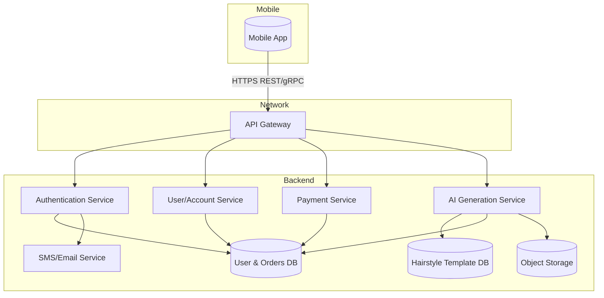
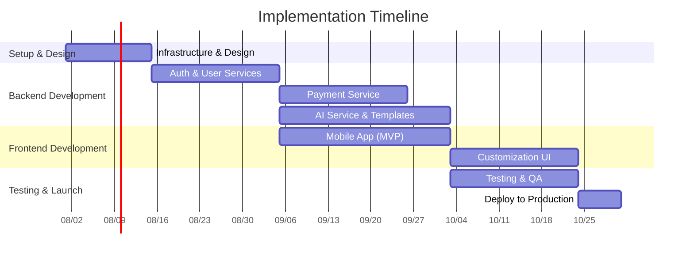

# Executive Summary  
The provided attachment describes a **mobile AI hairstyle try-on app** targeting the Chinese market. Key features include a large 3D hairstyle template library, selfie upload/capture with automatic face fitting, AI-powered 3D hairstyle blending and multi-angle preview, and fine-grained style adjustment (length, color, bangs, curliness, etc.). The app uses a domestic tech stack on Alibaba Cloud, with phone/SMS, WeChat, and Alipay login; and a dual payment model (membership subscription plus per-use “points”). 

To implement this, we propose a **modular, microservices-based architecture** with a cross-platform mobile frontend (e.g. Flutter or React Native), and a backend on Alibaba Cloud services. Key modules include User/Auth, Payment, Hair Template management, AI Image Service, and Data Storage. AI image generation can leverage Alibaba’s Platform for AI (PAI) with Stable Diffusion or ControlNet models for hair transfer. We will use Alibaba Cloud SMS for phone verification and official WeChat/Alipay SDKs for login and payment, ensuring compliance with Chinese regulations. 

**Risks** include handling sensitive face data under China’s Personal Information Protection Law (explicit consent, local storage, etc.), and the high compute cost of image generation (Stable Diffusion typically needs ~5 GB GPU memory and ~5 s per image). To mitigate this, we will require explicit user consent and implement data-encryption/audit (per CAC rules), and use GPU auto-scaling or batch processing (e.g. multi-GPU containers on Alibaba PAI) to handle load efficiently. 

Our **implementation plan** is phased:  
- **Phase 1 (2-3 weeks):** Project setup (cloud infra, code repo, CI/CD pipeline), API-first design of user/auth and DB schemas.  
- **Phase 2 (3-4 weeks):** Develop core backend services – user auth (SMS/WeChat/Alipay integration), payment subsystem (WeChat/Alipay payment API), and hair template management.  
- **Phase 3 (4 weeks):** AI pipeline integration – deploy Stable Diffusion/ControlNet on Alibaba Cloud (Docker/ECS or Serverless); build APIs for image generation and processing (face detection, rendering).  
- **Phase 4 (3-4 weeks):** Frontend development – cross-platform mobile app with login screens, camera/upload, gallery of hairstyles, and the 3D preview/customization UI. Implement real-time adjustment sliders and sync with backend API.  
- **Phase 5 (2-3 weeks):** Testing, optimization, and deployment – end-to-end QA, performance tuning (caching pre-generated results), documentation, and rollout. Include rollback strategy (versioned releases, database backups).

The project timeline is illustrated below. We recommend Agile sprints with continuous integration (e.g. Jenkins on Alibaba Cloud DevOps). Testing will cover unit/integration tests for services, automated UI tests (mobile), and security audits. A rollback plan involves staged deployment (canary or blue-green) and keeping nightly backups of data.

## Static Analysis of Attachment  
The attached `todo.md` is a **product requirement specification (in Chinese)**, not source code. It defines the app’s goals, target users (China’s hair salon customers), deployment requirements, and features. No executable code is present, so we cannot “statically analyze code” in the traditional sense. Instead, we extract design implications:

- **Business Model & Compliance:** App must use Chinese (domestic) AI models, Alibaba Cloud infrastructure, and support Chinese payment/login (WeChat, Alipay, SMS). This implies strict adherence to Chinese cyber and data laws (e.g. PIPL), and integration with Alibaba Cloud services.
- **Core Functionality:** The app centers on *image processing* (merging user photos with hair templates) and *3D rendering*. It requires: a hairstyle template library (3D models or images), face detection, AI generative models for hair transfer, and real-time editing UI.
- **Infrastructure:** The spec explicitly calls for Aliyun hosting (including compute, DB, storage) and use of Chinese tech (LLMs, image gen). This suggests we’ll use Alibaba Cloud’s offerings (e.g. ECS, Container Service, PAI for AI workloads).
- **Modules (inferred):** Likely modules are: Authentication, Payment, User/Profile, Hair Templates, AI Generation Service, and a mobile client. Possibly an Admin panel for managing templates and monitoring usage.

Using these clues, we define the **architecture and components** in the sections below. 

## Functional Features & User Flows  
**Key Features (from spec):**  
- **Template Library:** A catalog of diverse 3D hairstyles (short, long, colored, business, casual, etc.), updated regularly.  
- **Image Input:** Users can **upload a photo** or use the camera. The app must perform **face detection and alignment** to prepare the image.  
- **3D Blend & Preview:** An AI engine merges the face with each selected hairstyle, producing a **3D preview**. Users can view the hairstyle from multiple angles and compare styles side-by-side.  
- **Fine Editing:** After choosing a style, users can adjust parameters (length, color, curl, bangs, volume). The preview updates in real-time using the generative model.  
- **Login/Account:** Phone-number registration (with SMS verification), and social logins via WeChat and Alipay with OAuth flows. Unified account management across methods.  
- **Payment:** Two payment modes – **subscription memberships** and **points-based pay-per-use**. Integrate WeChat Pay and Alipay APIs for purchases. Points are deducted for actions like “generate hairstyle image” or “apply 3D render”. Track user balance, order history, and usage logs in a database.  

**User Flows & UI Components:**  
1. **Onboarding:** User opens app → sees login/registration screen. Options: (a) Phone + SMS code, (b) WeChat OAuth, (c) Alipay OAuth. The app uses Alibaba Cloud’s SMS API and official social-login SDKs (WeChat/Alipay).  
2. **Home/Library:** After login, the user accesses the hairstyle gallery. UI shows categories or trending styles (with thumbnails). Search/filter by style type.  
3. **Capture/Upload:** User selects “Try On”, then chooses camera or upload. On selection, app captures photo. The image is sent to the backend AI service which detects the face (landmarks) and preprocesses it.  
4. **Generate Previews:** Backend returns a **grid of preview images** – the user’s face overlaid with various hairstyles (one for each template or category). If truly 3D, the user can tap a style to rotate the view.  
5. **Detailed View & Edit:** Selecting one hairstyle opens a preview screen. It shows the 3D view and a panel of sliders/buttons (length slider, color picker, etc.). Adjusting a parameter invokes the AI to regenerate the image.  
6. **Finalize & Purchase:** Once satisfied, the user can save/share the result, or confirm. If using points, a modal shows the point cost and deducts points; if on subscription, the cost may be zero or reduced. Payment integration occurs here.  
7. **Account/History:** User can view remaining points, subscription status, past generated images, and log out. The app also includes profile settings.

**UI Components:**
- **Login Screen:** Fields/buttons for phone+SMS, WeChat login, Alipay login.  
- **Gallery Screen:** Scrollable list/grid of hairstyles, category tabs. Each item shows a thumbnail and style name.  
- **Camera/Upload Screen:** Button to take photo or select from gallery. Use device camera and storage permissions.  
- **Preview Screen:** Shows the rendered face+hair image; navigation controls for 3D rotation (if 3D model, use a 3D widget; if 2D, maybe a “slide to view side” simulation). Buttons: “Customize”, “Save”, “Back”.  
- **Customization Panel:** Sliders (length, curl, etc.), color wheels, toggles for bangs or volume. Possibly preview updates on-the-fly or via “Apply” button.  
- **Payment Screen:** Shows packages (monthly, yearly subscription) and point-recharge options. Use official payment SDK UI.  
- **Account Screen:** Displays user info, remaining points, membership details, order history.

All API calls (for login, image generation, etc.) go through a central backend over HTTPS with JSON or gRPC. Images may be sent as multipart/form-data or base64.

## Technical Architecture & Modules  

We recommend a **microservices-style backend** on Alibaba Cloud, interfacing with a cross-platform mobile app. The high-level architecture is shown below:



**Key components:**  
- **Mobile App (Client):** iOS/Android app (possibly implemented in Flutter or React Native) that provides the UI flows described above. Communicates with backend APIs for all operations.  
- **API Gateway:** A RESTful gateway or load balancer (e.g. Spring Cloud Gateway or Nginx) exposing endpoints like `/auth/*`, `/user/*`, `/pay/*`, `/ai/*`. Handles routing, TLS termination, and simple rate-limiting.  
- **Authentication Service:** Manages user registration/login. Supports: phone+SMS (using Alibaba Cloud SMS service), WeChat OAuth, and Alipay OAuth. Issues JSON Web Tokens (JWT) or session tokens. It will use Alibaba Cloud’s **SMS Service** (Short Message Service) via Spring Boot starter and official SDKs for WeChat/Alipay login.  
- **User/Profile Service:** Tracks user profiles, point balances, subscription status, generation history, etc. Stores data in a relational DB (e.g. Alibaba RDS MySQL) or NoSQL (Alibaba Table Store) depending on needs.  
- **Payment Service:** Integrates with WeChat Pay and Alipay APIs to handle purchases. It creates orders, validates payments, updates user points or subscription state. Uses official merchant SDKs. This service should follow strict security (server-to-server signed requests).  
- **Hairstyle Template DB:** A database or object store of hairstyle templates. Could store 3D model files or image masks in **Alibaba OSS (Object Storage Service)** and metadata (style name, category, 3D parameters) in a database.  
- **AI Generation Service:** The core image-processing engine. Runs on GPU instances (e.g. Alibaba ECS with GPU or PAI on Elastic Container Instance). It performs:  
   - *Face Detection/Alignment:* Detect facial landmarks (can use a pre-trained model or Alibaba’s offline face SDK).  
   - *Hair Segmentation/Overlay:* Merge the user’s face with a selected hairstyle. Techniques: possible use of ControlNet or LoRA to inpaint the user with the hairstyle (as shown in Alibaba’s Virtual Dressing example).  
   - *Real-time Adjustment:* For each parameter change, re-run the model with new instructions (e.g. adjusting length via prompt or control parameters in the model).  
   - *3D Preview:* If true 3D, rotate the model and render multiple angles; otherwise simulate different view via model.  
  This service interacts with **TemplateDB** (fetch hair asset) and **UserDB/Storage** (to save result images).  
- **Object Storage:** User photos, generated images, and 3D model assets can be stored in OSS. This decouples large file storage from the application servers.  
- **SMS/Notification Service:** Uses Alibaba Cloud SMS for sending verification codes. Also for transaction notifications or alerts. 
- **Database:** A central database stores user info, orders, points, and references to hairstyle templates. Spring Cloud Alibaba provides connectors for RDS MySQL. We may also use **Alibaba Nacos** for configuration and service discovery, and **Alibaba Sentinel** for flow control to protect against overload.  

This modular design (user, auth, payment, AI as separate services) aligns with **backend-first mobile best practices**: each microservice has a single responsibility, can scale independently, and failures are contained. For example, the AI service may be scaled out on multiple GPU containers, while the auth/payment services remain lean.

**Language/Framework Choices:**  
- **Backend:** A good fit is Java/Spring Boot with Spring Cloud Alibaba extensions. Spring Cloud Alibaba simplifies integrating Alibaba middleware (Nacos, RocketMQ, OSS, SMS) via Spring starters. Alternatively, Node.js (Express or NestJS) or Python (FastAPI/Flask) could be used, especially if the team prefers JavaScript/Python. But given the heavy integration with Alibaba services, Spring Cloud Alibaba is particularly convenient.  
- **Frontend:** Cross-platform frameworks like **Flutter** or **React Native**. Flutter gives near-native performance and UI flexibility, but React Native allows reuse of JavaScript skills. We will compare options in the alternatives section.  
- **AI Models:** Use proven generative models such as Stable Diffusion with ControlNet to preserve hairstyle details. The Alibaba PAI example shows using Stable Diffusion and LoRA models for try-on with GPU containers. We can similarly deploy a Docker container of SD with appropriate models (face-segmentation LoRA, hair-color ControlNet) and expose an HTTP API for inference.  
- **CI/CD:** We suggest using Jenkins (or Alibaba Cloud DevOps) for continuous integration. For each commit, the backend code is built into Docker images and pushed to Alibaba Container Registry, then deployed to ECS or Kubernetes; the mobile app is built via automated pipelines and distributed (beta testing or app stores).  

## Data Models (Draft Schema)  
Based on the requirements, core data entities include:  

- **User:** { user_id, phone_number, wechat_id, alipay_id, hashed_password, created_at, last_login, ... }.  
- **Account/Credits:** { user_id, points_balance, subscription_plan, subscription_expiry, ... }.  
- **Order/Transaction:** { order_id, user_id, amount, points_used, payment_method, status, timestamp }.  
- **HairTemplate:** { template_id, name, category, model_url (OSS), thumbnail_url, attributes (length, curl, etc.), update_date }.  
- **GeneratedImage:** { image_id, user_id, template_id, parameter_settings, image_url, timestamp }.  
- **Settings/Parameters:** (could be JSON) storing user-adjusted parameters for a hairstyle.  

These would be stored in a relational DB (MySQL or PostgreSQL on Alibaba RDS) for transactions and joins. Static data like images and 3D models reside in OSS, with DB entries referencing their URLs. We may also use a NoSQL (Redis) cache for frequently accessed templates or sessions.

## Security, Performance & Scalability Risks  

- **Data Privacy (Sensitive Biometrics):** The app processes users’ facial images, which are highly sensitive under Chinese law. The Personal Information Protection Law (PIPL) and recent CAC regulations demand **explicit informed consent** before processing facial data. We must present clear privacy notices and allow users (or guardians for minors) to opt in. All face data should be stored **locally in China** (Alibaba Cloud China) and only as long as needed. A privacy impact assessment is required. To mitigate risk, only store images temporarily and delete them after processing; use encryption at rest and in transit (HTTPS, OSS encryption). We will not use face data for any purpose beyond image generation. 
- **Authentication & Payment Security:** Implement secure login (OAuth tokens, two-factor via SMS) and store credentials securely. Use **WeChat/Alipay official APIs** to avoid non-compliance, and follow their guidelines for certificate-based signing. The payment service must be isolated and PCI-compliant; always verify payment callbacks server-to-server. Potential risk: if an attacker simulates requests, ensure robust validation. Use Alibaba Cloud’s security groups and VPC to isolate internal services. 
- **AI Model Bias & Quality:** Generative models can produce unexpected or inappropriate results. Risk: the model might generate unrealistic or culturally inappropriate hairstyles. Mitigation: fine-tune models on controlled datasets (Chinese-style hair), and include content filters. Provide an easy **“retry”** button if output is unsatisfactory, or fallback to simpler overlay if the model fails. 
- **Performance (Latency & Cost):** Generating an image with Stable Diffusion takes **~5 seconds and ~5 GB GPU RAM per image**. If users expect multiple previews or real-time editing, this is a bottleneck. We will mitigate by:  
  - **Batching & Async:** Queue generation requests and process in parallel GPU instances. Inform users of expected wait times or show progress spinners.  
  - **Optimized Hardware:** Use multiple GPU instances (e.g. ECS GN6v with Ampere GPUs) or Alibaba’s Elastic GPU. Consider FP16 precision to halve VRAM need (as noted in benchmarks).  
  - **Caching:** Pre-generate previews for static templates (without user face) and overlay user face on top for instant previews. For user-specific blends, cache popular results.  
  - **Edge vs. Cloud:** Given weight of models, inference will run on cloud (Aliyun GPU servers), not on-device.  
- **Scalability:** The system should scale as user demand grows. Key points:  
  - **Auto-Scaling:** Use Kubernetes or Alibaba’s Auto Scaling to add more AI Service replicas under high load.  
  - **Microservices:** Since components are decoupled, we can scale only the heavy modules (AI generation, database read-replicas) without impacting auth or UI. This follows best practice for mobile backends.  
  - **Database Load:** Use read replicas and caching (Redis) to handle many simultaneous queries (e.g. browsing templates, checking points).  
- **Maintainability:** A monolithic system would be hard to update. By using microservices and well-defined APIs (API-first approach), we can update one service at a time. Use versioned APIs to avoid breaking mobile apps. Continuously integrate and test each component. Containerize services for consistent environments.  
- **Compliance (Chinese Tech Stack):** The requirement to use domestic AI means we must avoid banned technologies. For example, using ChatGPT or foreign LLMs is disallowed. We’ll use Chinese alternatives (e.g. PaddlePaddle models, or Alibaba Cloud’s AI). If open-source like Stable Diffusion is used, it must be hosted on Chinese infrastructure (no foreign cloud). All code and data should reside in Alibaba’s China data centers.  

## Implementation Plan (Phased)  

We propose delivering the project in **agile sprints**, with each phase culminating in a demonstrable milestone. Below is a high-level plan with estimated effort (in person-days, pd) assuming a small team (e.g. 3-5 developers, 1 QA, 1 PM):

| Phase & Milestone              | Tasks                                                            | Duration | Effort (pd) | Dependencies |
|--------------------------------|------------------------------------------------------------------|----------|-------------|--------------|
| **Phase 1: Setup & Design**    | Define APIs/schema, set up repos, CI/CD; provision cloud infra (network, VPC, base DB, OSS buckets); choose tech stack. | 2 weeks  | 20          | –            |
| *Milestone:* Basic environment ready; design docs complete. | | | | |
| **Phase 2: Core Backend**      | Implement Auth (SMS/WeChat/Alipay login) and User service (user profile, point logic). Integrate Alibaba SMS API. Set up database (RDS). | 3 weeks  | 30          | Phase1       |
| *Milestone:* Users can register/login; user data stored. | | | | |
| **Phase 3: Payment & Accounts**| Build Payment service: WeChat Pay and Alipay integrations. Develop membership and points management. Test payment workflows. | 3 weeks  | 30          | Phase2       |
| *Milestone:* Payments working; points/subscriptions tracked. | | | | |
| **Phase 4: Hairstyle Backend** | Develop HairTemplate service: upload/store templates (OSS), manage categories. Implement AI Service prototype: deploy Stable Diffusion/LoRA in a container (using Alibaba PAI Docker); build API for image generation (face alignment + overlay). | 4 weeks  | 40          | Phase2       |
| *Milestone:* AI service can generate a hairstyle-on-face image for a test template. | | | | |
| **Phase 5: Frontend MVP**      | Develop Mobile App (login, gallery, capture, display AI results). Connect to backend APIs. Basic UI for selecting hair and viewing result. | 4 weeks  | 40          | Phases2-4    |
| *Milestone:* End-to-end flow: Login → choose photo → get preview. | | | | |
| **Phase 6: Customization UI**  | Add editing controls (sliders, etc.). Hook up to AI service for real-time updates. Polish UI/UX. | 3 weeks  | 30          | Phase5       |
| *Milestone:* Users can adjust parameters and see updated image. | | | | |
| **Phase 7: Testing & Deployment**| Write tests (unit, integration). Conduct security audit and performance load testing. Fix issues. Deploy to production environment. | 3 weeks  | 20          | All above   |
| *Milestone:* App passes QA; launch plan ready. | | | | |

_Total Effort:_ ~210 person-days (approx. 4-5 months for a small team, possibly parallelized by dividing frontend/backend tasks).

**CI/CD & Testing:** We will set up Jenkins pipelines (or Alibaba DevOps) from the start. Each code merge triggers automated builds, tests, and deployment to a staging environment. For example, a Jenkinsfile for the backend might include stages: `build` (compile, Dockerize), `test` (unit tests, lint), `deploy-staging`, and `deploy-prod` with manual approval. We’ll use code reviews and maintain test coverage targets.

**Milestones:** We align deliverables with major features (auth/login, payment, AI generation, UI) so stakeholders see progress. Each milestone ends with a demo and retrospective to adjust next steps. 

**Rollback Plan:** Each deployment will be version-tagged. We will maintain backups of the database (daily snapshots) and use Alibaba RDS backup features. In case of failure, we can roll back to the previous container image and DB snapshot. The mobile app should also implement in-app version checks so users can update or rollback if needed.

## Deployment Architecture Diagram  

Below is a **Mermaid diagram** of the deployment architecture:

```mermaid
graph LR
  subgraph Mobile_Device
    App[Mobile App (iOS/Android)]
  end
  subgraph Alibaba_Cloud
    LB[Load Balancer/API Gateway]
    subgraph VPC
      AuthSrv[Auth Service]
      UserSrv[User Service]
      PaySrv[Payment Service]
      AISrv[AI Generation Service]
      OSS[(Object Storage)]
      RDS[(RDS MySQL)]
      Nacos[Nacos (Config/Discovery)]
      SMS[SMS Service]
    end
  end

  App -->|HTTPS/JSON| LB
  LB --> AuthSrv
  LB --> UserSrv
  LB --> PaySrv
  LB --> AISrv

  AuthSrv --> RDS
  UserSrv --> RDS
  PaySrv --> RDS
  AISrv --> RDS
  AISrv --> OSS
  AuthSrv --> SMS
```

In this diagram, all services run within Alibaba’s VPC. The Load Balancer (or API Gateway) distributes requests to microservices (Auth, User, Payment, AI). The AI service is deployed on GPU-enabled ECS or Container Instances. OSS (Object Storage) holds static assets (photos, templates). Nacos is used behind the scenes for service discovery and config, but not explicitly shown. 

## Project Timeline (Gantt)  



- **Aug 2026:** Project kickoff, infrastructure provisioning, API design (a1).  
- **Sept-Oct 2026:** Authentication, user and payment services built (a2, a3), along with initial mobile UI for login.  
- **Oct-Nov 2026:** AI generation service deployed and integrated (a4); mobile UI for gallery and preview (a5).  
- **Nov 2026:** Customization controls added (a6).  
- **Dec 2026:** Testing, bug-fixes, and deployment (a7, a8). 

This schedule assumes some overlap (e.g. mobile UI can start once auth API is ready). Regular sprint planning will refine these dates.

## Technology Alternatives  

We evaluated multiple technology stacks. Below is a comparison of major components:

| Component     | Option A (Recommended)         | Option B                      | Option C                      |
|---------------|--------------------------------|-------------------------------|-------------------------------|
| **Mobile Framework** | **Flutter** – High-performance (60–120 FPS) UI, near-100% code reuse, excellent for custom graphics. Strong community (170k GitHub stars). <br>*Pros:* Native rendering, fast animations, good tooling.<br>*Cons:* Uses Dart (learning curve), larger app size. | **React Native** – JavaScript-based, 80–90% code reuse, easy for teams with JS skills. <br>*Pros:* Leverages web development skills, lots of libraries.<br>*Cons:* UI consistency issues, relies on JS bridge (slower than Flutter). | **Native (Swift/Kotlin)** – Platform-specific. <br>*Pros:* Best performance and full access to APIs. <br>*Cons:* Double effort (iOS+Android), harder maintenance. |
| **Backend Language/Framework** | **Spring Boot + Spring Cloud Alibaba** – Java framework with Alibaba integrations. Built-in support for Nacos, Sentinel, OSS, SMS, etc. <br>*Pros:* Mature, robust, excellent Alibaba support. <br>*Cons:* Heavier setup. | **Node.js (Express/Nest)** – JavaScript/TypeScript. Quick development, many libraries. <br>*Pros:* Fast prototyping, unify stack with React Native. <br>*Cons:* Less native Alibaba integration, concurrency model (single-threaded) may need care. | **Python (FastAPI)** – Lightweight, easy for ML tasks. <br>*Pros:* Great for AI model integration, quick dev. <br>*Cons:* Slower raw performance, less enterprise features. |
| **AI Model Approach** | **Stable Diffusion + ControlNet/LoRA** – Use pre-trained diffusion models fine-tuned for hair transfer, as in Alibaba’s demo. <br>*Pros:* State-of-art quality, flexible attributes. <br>*Cons:* Heavy compute. | **GAN-based Transfer (pix2pixHD)** – Traditional conditional GAN for hair transfer. <br>*Pros:* Potentially faster inference. <br>*Cons:* Harder to train, less flexible. | **3D Graphics Engine** – Pre-defined 3D hair models mapped onto 3D face mesh. <br>*Pros:* Real 3D rotation inherently. <br>*Cons:* Requires sophisticated 3D modeling and real-time rendering on mobile, complex. |
| **Database**       | **MySQL (Alibaba RDS)** – Relational, ACID compliance. Good for user/accounts data. <br>*Pros:* Maturity, supports transactions. <br>*Cons:* Scaling reads requires replicas. | **MongoDB (Tencent TDSQL or Aliyun Mongo)** – Document DB. <br>*Pros:* Flexible schema for images/metadata. <br>*Cons:* No joins, eventual consistency. | **PostgreSQL** – Similar to MySQL, open-source. <br>*Pros:* Advanced features (JSON, full-text search). <br>*Cons:* Not natively managed in all Chinese cloud services. |
| **Hosting/Deployment** | **Alibaba ECS + Container Service (ACK)** – Virtual servers with Kubernetes. <br>*Pros:* Full control, compatibility with Alibaba ecosystem. <br>*Cons:* Requires more ops. | **Serverless (Function Compute + API Gateway)** – Minimal ops. <br>*Pros:* Auto-scaling, pay-per-use. <br>*Cons:* Cold start latency for heavy AI tasks; less control over GPUs. | **Hybrid (ECS for AI, Function Compute for Auth)** – Balance. <br>*Pros:* Optimize each part. <br>*Cons:* More complexity. |

**Rationale:** We lean toward Flutter and Spring Cloud Alibaba for rapid development and easy Alibaba integration. Stable Diffusion on ECS mirrors Alibaba’s PAI example. For data, a relational DB matches the structured needs (users, orders).

## Next Steps & Recommendations  
- **Proof of Concept:** Quickly prototype the AI pipeline by deploying a Stable Diffusion container on Alibaba PAI (following Alibaba’s guide) and testing hair transfer on sample images.  
- **Detailed Design:** Finalize API contracts and data schemas (using OpenAPI/Swagger).  
- **Compliance Checklist:** Prepare user consent flows and data policies in accordance with PIPL and CAC facial data rules.  
- **Team & Resources:** Allocate roles (e.g. 1 mobile dev, 2 backend devs, 1 ML engineer, 1 QA). Acquire GPUs or Alibaba credits for development.  
- **Iterate & Validate:** After MVP, gather user feedback. Plan future phases (analytics, more AR features, etc.) based on usage data.  

By following this plan, we ensure a scalable, secure implementation that meets the specified requirements and complies with all relevant regulations, leading to a robust AI hairstyle try-on app.

## References  
- Alibaba Cloud PAI Virtual Try-On Tutorial (Stable Diffusion for clothing) – Example of deploying generative AI on Alibaba Cloud.  
- Lambda Labs Stable Diffusion Benchmark – GPU requirements for image generation (≈5s, 5GB VRAM per 512×512 image).  
- Touchlane Blog on Mobile Backend Best Practices – Advocates microservices, cloud-native APIs for mobile apps.  
- Droidonroids Flutter vs React Native Guide (2026) – Performance and code-reuse comparison for cross-platform frameworks.  
- Spring Cloud Alibaba Project – Integration of Alibaba middleware (Nacos, SMS, etc.) into Java Spring Boot.  
- Biometric Update on China Facial Recognition Rules – Chinese regulations requiring explicit consent and protecting biometric data. 

